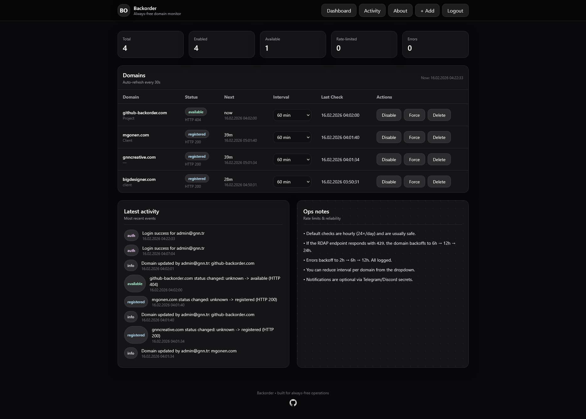
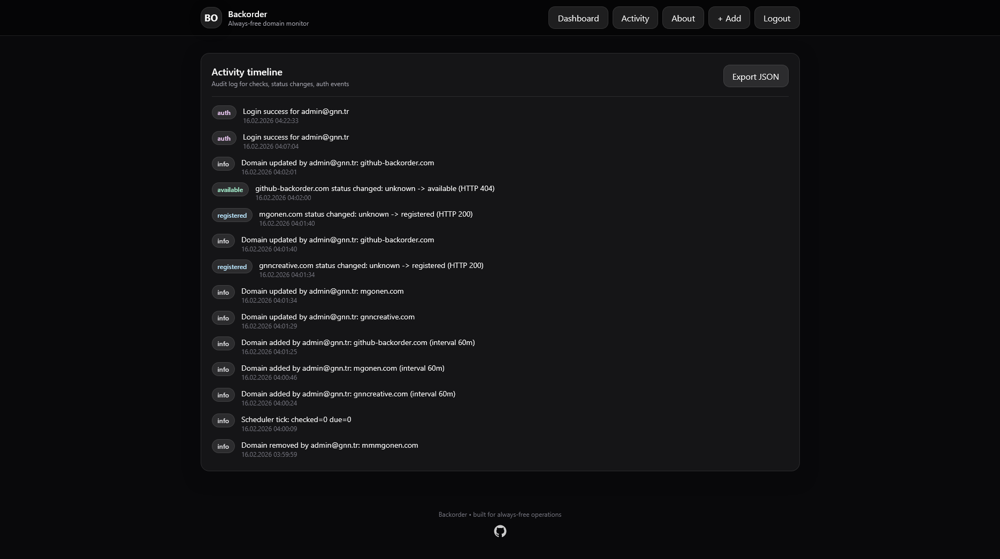
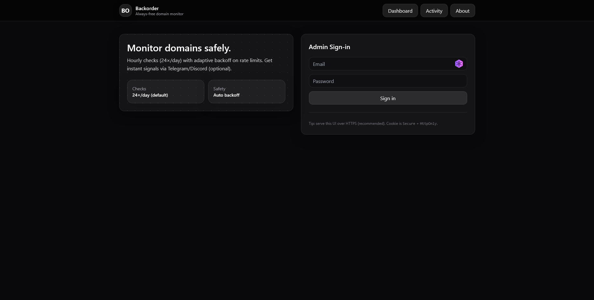
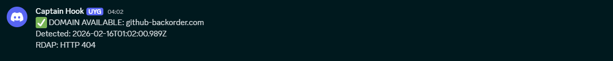

# Backorder – Always‑Free Domain Monitor

Backorder is a production‑ready, always‑free **domain availability (backorder-style) monitoring** system.

- **Backend:** Cloudflare Workers + D1 (serverless SQLite)
- **Frontend:** Static React dashboard (Vite + Tailwind) served from **Apache (WHM/cPanel / AlmaLinux 8 compatible)**
- **Checks:** Hourly by default (24×/day) with adaptive backoff on rate limits
- **Signals:** Optional Discord / Telegram notifications when a domain becomes **available**

> Disclaimer: This tool detects availability signals; it does not guarantee successful domain capture/registration.

---

## Screenshots

### Dashboard

### Activity timeline

### Login

### Discord webhook notification

---

## Features

- Admin sign‑in (single admin) with secure password hashing (**PBKDF2 100k**) and hashed session tokens in storage
- Domain list: add / delete / enable / disable
- Per‑domain interval selector (default 60 min)
- **Force** button triggers an immediate check
- Hourly cron scheduler (safe defaults) + adaptive backoff:
  - On **429**: 6h → 12h → 24h
  - On repeated errors: 2h → 6h → 12h
- Event log (audit timeline) + JSON export
- Optional notifications:
  - **Discord webhook** (recommended)
  - Telegram Bot (optional)

---

## Always‑free architecture

- Cloudflare Workers (free)
- Cloudflare D1 (free quota)
- Static frontend on your existing Apache/cPanel hosting (no extra cost)
- No paid queues, no paid databases, no paid monitoring services

---

## Quick start

See **docs/SETUP.md** for full setup.

---

## Security notes

- Secrets are stored only in Cloudflare (Wrangler secrets). **Never commit secrets to GitHub.**
- Built-in hardening:
  - `/api/login` rate limit (5 failed attempts/min per IP, temporary block)
  - Session cookie uses `__Host-` prefix, `HttpOnly`, `Secure`, `SameSite=Lax`
- Recommended additional hardening:
  - Add Cloudflare WAF rate limit rules in front of the Worker
  - Use a custom domain so UI + API share the same site (simpler cookies/CORS)

---

## License

MIT
